# Fxplorer
ScenicView is an excellent tool for debugging the properties of the nodes in scenegraph  when the application is still running. However, it has some limitations and lacks few essential features that are quite helpful for programming/debugging. To fill those gaps, a  new tool (**Fxplorer**) is developed, which will be mostly identical to ScenicView but also with added features.

*Prerequisite : This tool can run only on JDK 17+ versions only.*

When the tool is started, the tool will be displayed as below:

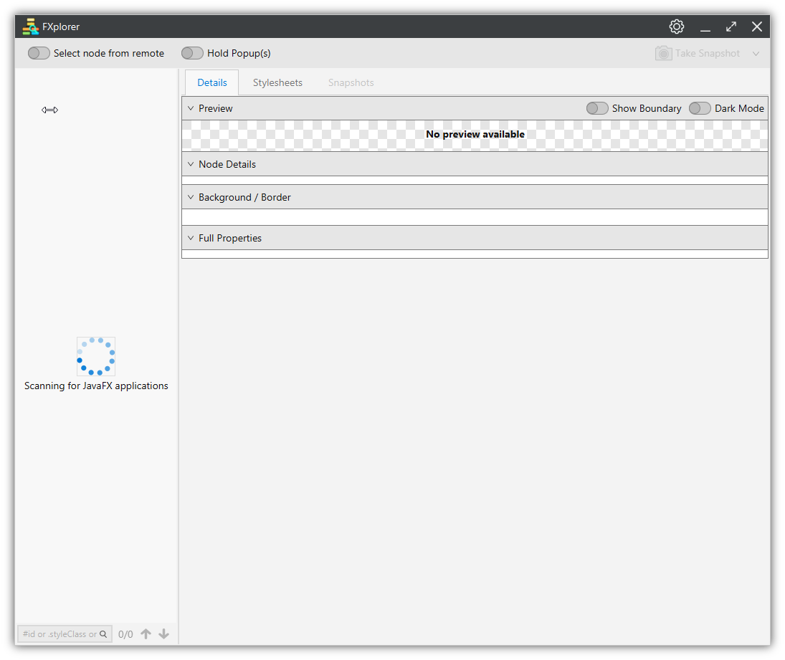

## Features

* The tool will automatically loads all the JavaFX applications which are launched with JDK17+.

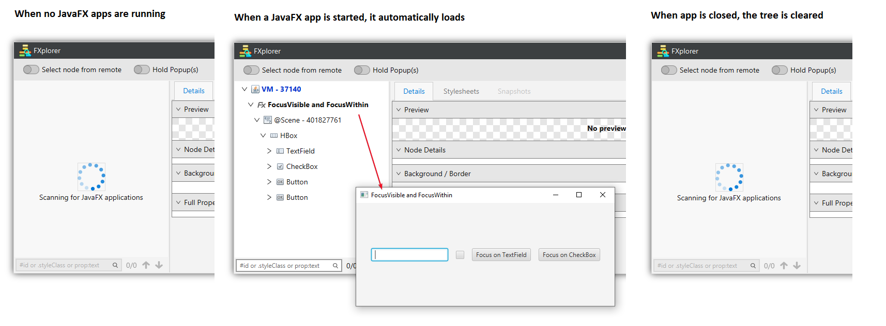

* A node can be searched by its **id** or the **style class** or by any **property and its value**. This will perform a case insensitive search using **contains**. So if any node contains the search text in the provided property, can be traversed.

For example:
   1. Search by id by typing #<***nodeid***> Eg: #mycheckbox   
   2. Search by style class by typing .<***styleClass***> Eg: .button   
   3. Search by property key-value by typing <***property***>:<***value***> Eg: *height*:*25* or *width*:*16* or *disabled*:*false*

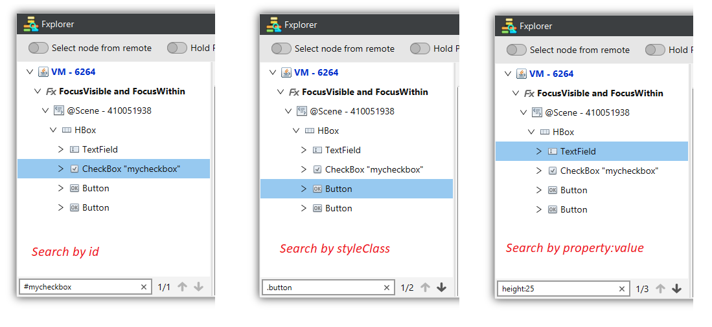

* **Select node from remote:** Turning ON this button will allow to select the node by directly clicking on the remote app. When the button is turned ON, mouse hovering on the nodes will highlight the node bounds which will assist in selecting the node precisely.  When a node is selected, the button will automatically turned OFF.

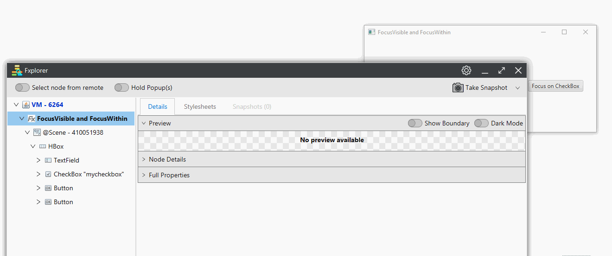

* **Hold Popup(s):** The usual behaviour of Popup is to hide when the focus is moved to another window. This makes it quite impossible to inspect the Popup scenegraph using standard ScenicView. Turning ON this button will allow to inspect the Popup layout, even when the Popup is closed.
Turning OFF the button will remove all the instances of Popup from the tree.

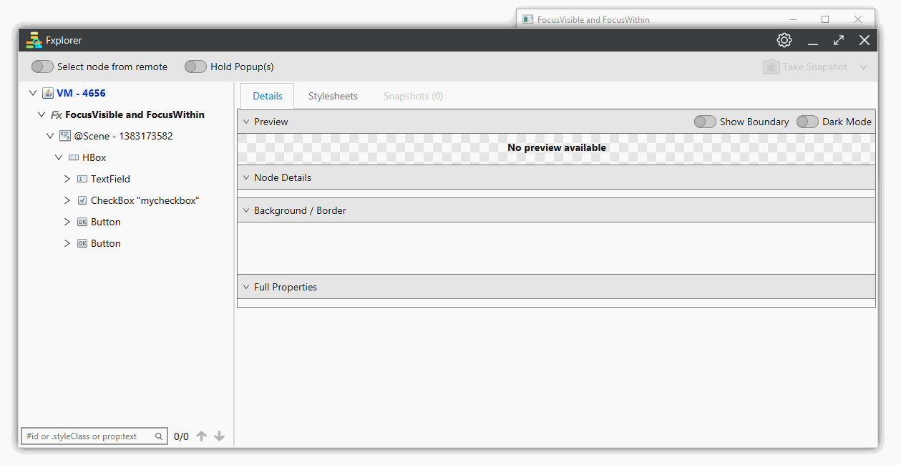

### Inspecting Node Details:
Node details can be inspected in the three tabs.

* **Details** : Provides all the properties values at the current instance of the node. All the properties are updated instantly reflecting the current state of the node. 
* **Stylesheets** : Provides the list of all stylesheets applied on the node. This will also provide a detailed hierarchy of stylesheets letting us know at which level each style sheet is applied.
* **Snapshots** : All the snapshots of the node can be viewed in this tab. A detailed explanation is done down the page.

### Details: 

#### Preview:
This provides the preview (screenshot) of the node with the same dimensions as it is rendered in the scenegraph.

* **Show Boundary** : Turning ON this button will show the boundary of the node in the preview. This is quite helpful to visualize the boundaries of a node which has a transparent background.
* **Dark Mode** : Turning ON this button will change the background of the preview content. This is helpful when visualizing nodes which has light theme.
* **Press & Hold to highlight**: Pressing and holding this button will highlight the node in the remote app. This is helpful to visualize the boundaries of the node on the remote app.

Below is a gif demonstrating the features of all three buttons.

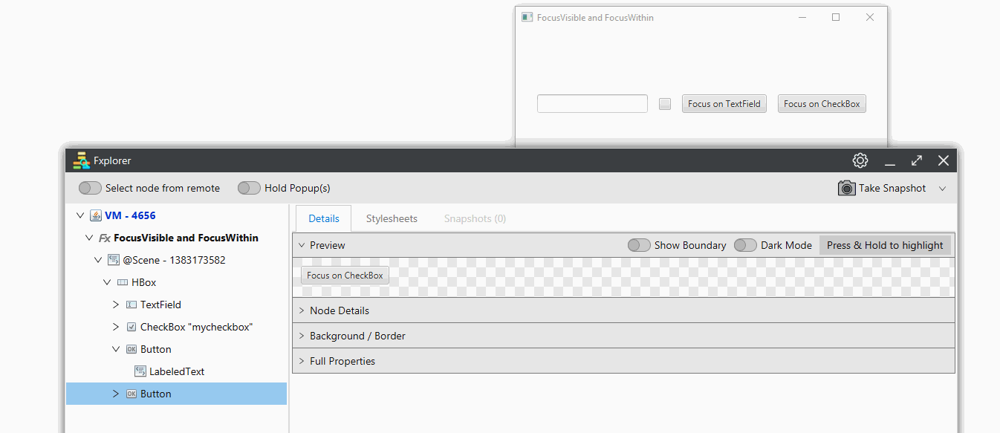

#### Node Details:
This section contains the basic properties of the node that are quite helpful or inspected frequently. Note that the properties may slightly vary from node to node.

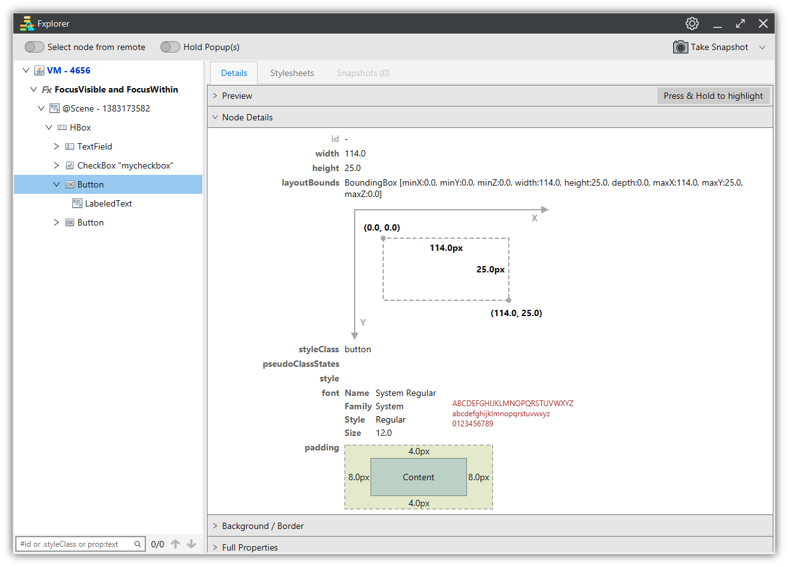

#### Background / Border:
A separate section is allocated to show the details of Background and Border properties. This section displays the details of each property quite elaborately with preview of colours and borders styles.

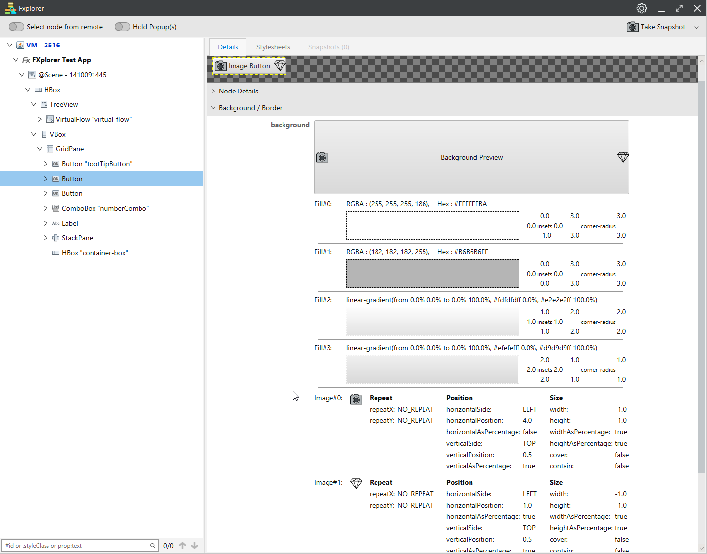

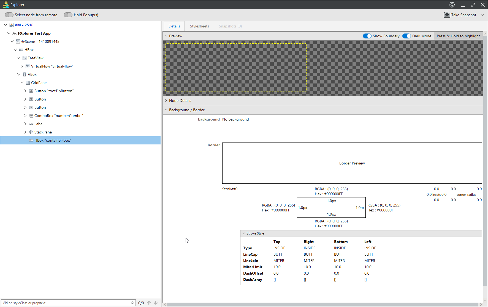

#### Full Properties :
All the properties details of the node are listed in this section. Note that height, width and layoutBounds properties are displayed in red colour for quick catch.

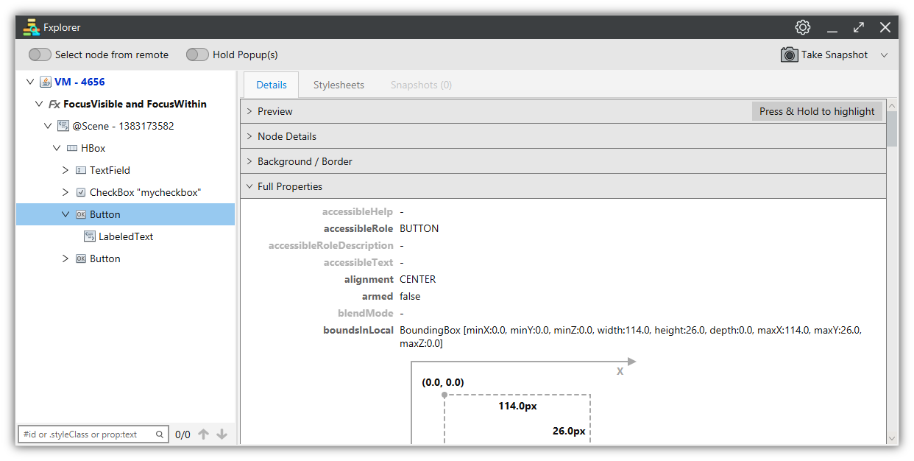

### Stylesheets:
This tab displays all the style sheets that are applied on the node. It also provides the details of which stylesheet is applied at what level of parent hierarchy. 

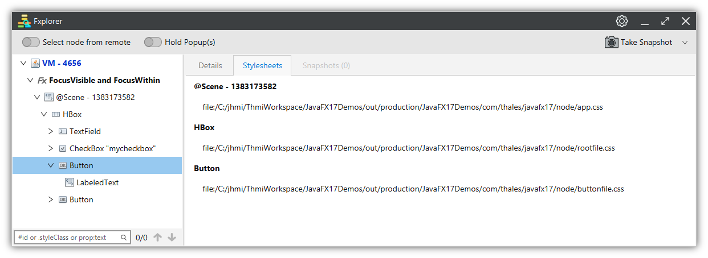

### Snapshots
Snapshot is a feature which lets to save the current state of a node for future reference. It will allow to take as many snapshots as we can. All the snapshots are identified with the time they are taken and are listed in the Snapshots tab.

When a node has no snapshots the tab is disabled.

Snapshot can be taken instantly or with a delay of 5 seconds and 10 seconds. When taking snapshot with delay, a progress bar is displayed about the time left, which allows the user to navigate the mouse and interact with the JavaFX application. 

This is quite helpful to take a snapshot of a node when in mouse hovered state, etc.

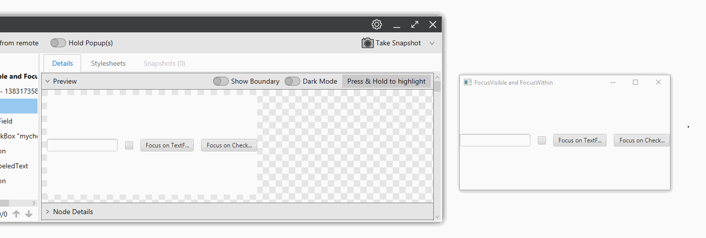

#### Inspecting & Comparing snapshots
Selecting the snapshot by time will load the snapshot details in right pane. Note that snapshot does not keep track of stylesheets information. All the other details of the node can be viewed in the four sections. 

Note that a snapshot will only keep track of the selected node and NOT its children.

We can compare two snapshots by selection multiple snapshots (using ctrl key) → right click → click Compare. A new window is opened listing only the properties which are modified. 

Please note that this will only compare the node details and not the children details. So though visually you may notice that the node is modified, but sometimes it is the children that are modified and you may not see any changes to the selected node.

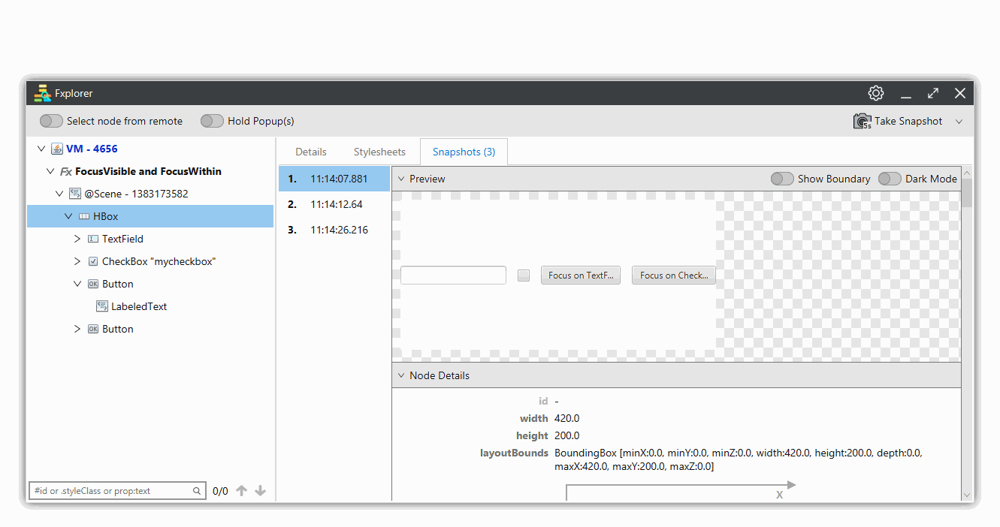

### Themes
And lastly we have an option to switch the themes of the tool between light and dark mode.

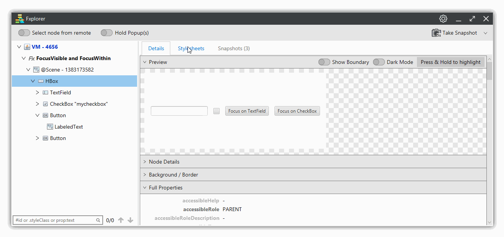
